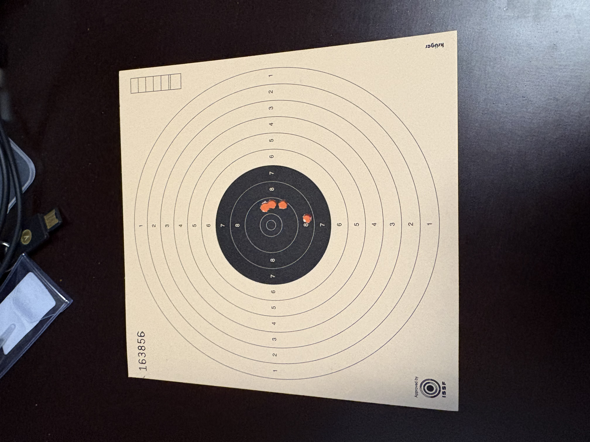
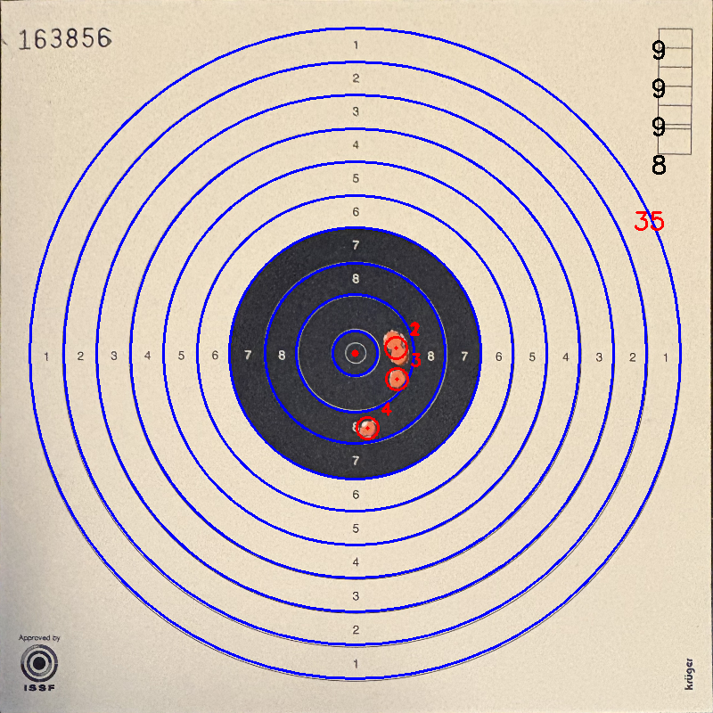

# ISSF Target Analyzer Prototype

A Python-based prototype using OpenCV and Tesseract OCR to automatically detect, warp, and analyze ISSF shooting targets.

## Features

- **Automated Perspective Warping:** Detects the target card edges against a dark background and warps it to a square 800x800 pixel image.
    
- **Robust Ring Detection:** Locates the exact mathematical center of the black "Spiegel" and aligns concentric scoring rings precisely, even on warped or wrinkled cardboard.
    
- **Target Number OCR:** Extracts the printed target ID from the top-left corner using Pytesseract.
    
- **Color-Based Hole Detection:** Uses HSV color filtering to detect bullet holes backed by a bright colored (orange) contrast card.
    
- **Cluster Resolution:** Estimates shot counts within tight groupings based on detected pixel area size.
    
- **Automated Export:** Overlays scores onto the final image saved as `<target_number>.png` and exports data to `<target_number>.csv`.


<figure>
  
  <figcaption>Bild 1: Foto der Zielscheibe.</figcaption>
</figure>

<figure>
  
  <figcaption>Bild 2: Automatisch analysierte Zielscheibe mit erkannten Ringen und Treffern.</figcaption>
</figure>

## Prerequisites

### System Dependencies

Tesseract OCR engine is required for text recognition.

**macOS:**

```
brew install tesseract
```

**Linux (Fedora):**

```
sudo dnf install tesseract
```

_(On Fedora Silverblue, you might want to layer it via `rpm-ostree install tesseract` or use a toolbox/distrobox)._

### Python Dependencies

Managed via `uv`:

```
uv add opencv-python numpy pytesseract
```

## Usage

1. Save your raw target photo as `target.jpeg` in the project directory.
    
2. Ensure an orange contrast backing card is placed behind the target holes.
    
3. Run the analysis pipeline:
    
    ```
    uv run main.py
    ```
    

## Output

- **`<number>.png`**: The processed target image with blue scoring rings, red markers for detected holes, and the scoreboard overlay.
    
- **`<number>.csv`**: Semicolon-separated file containing shot numbers and corresponding ring values (e.g., `1;10`).
